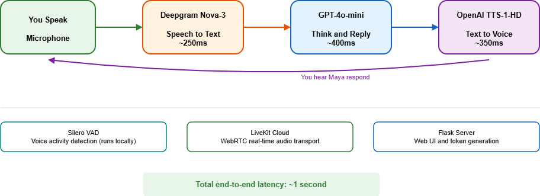
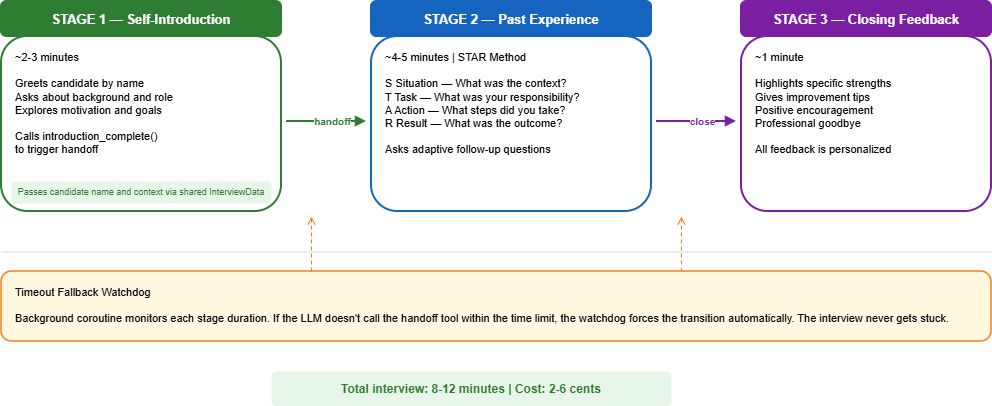

# AI Mock Interview Agent

A voice-powered AI interview coach that conducts realistic mock interviews using LiveKit's multi-agent framework. The AI interviewer **Maya** speaks with you in real time, asks adaptive follow-up questions using the STAR method, and delivers personalized feedback at the end.

## Features

- **Two-stage interview** — Self-Introduction → Past Experience (STAR method)
- **Multi-agent architecture** — Each stage is a specialized agent with focused prompts
- **Tool-based handoffs** — Seamless transitions between agents with no interruptions or repeated prompts
- **Time-based fallback** — Background watchdog guarantees the interview always progresses
- **Personalized closing** — Maya gives specific strengths, improvement tips, and a warm goodbye
- **Web interface** — Live transcript, progress tracking, mute/end controls

## Architecture



### Multi-Agent Flow




## Tech Stack

| Component | Technology | Purpose |
|-----------|-----------|---------|
| Framework | LiveKit Agents v1.4 | Multi-agent orchestration + WebRTC |
| STT | Deepgram Nova-3 | Speech-to-Text |
| LLM | OpenAI GPT-4o-mini | Interview question generation |
| TTS | OpenAI TTS-1-HD (nova) | Natural voice synthesis |
| VAD | Silero | Voice activity detection (local) |
| Frontend | Flask + HTML/JS | Web UI with LiveKit JS SDK |

## Setup

### Prerequisites

- Python 3.11+
- API keys for LiveKit, Deepgram, and OpenAI

### Installation

```bash
# Clone the repo
git clone https://github.com/Ajaykumar496/ai-mock-interview.git
cd ai-mock-interview

# Create virtual environment
python -m venv .venv

# Activate virtual environment
# Windows:
.venv\Scripts\activate
# macOS/Linux:
source .venv/bin/activate

# Install dependencies
pip install -r requirements.txt

# Configure environment variables
# Windows:
copy .env.example .env
# macOS/Linux:
cp .env.example .env
# Edit .env and add your API keys
```

### Running

Open **two terminals**:

```bash
# Terminal 1 — Start the AI agent
python agent.py dev

# Terminal 2 — Start the web server
python server.py
```

Open your browser at **http://localhost:5000**, type your name, click **Start Interview**, and allow microphone access.

## Project Structure

```
ai-mock-interview/
├── templates/
│   └── index.html        # Web frontend (LiveKit JS SDK)
├── .env.example          # Environment variable template
├── agent.py              # AI interviewer — multi-agent logic
├── server.py             # Flask server — token generation
├── requirements.txt      # Python dependencies
├── voice-pipeline.png    # Architecture diagram
├── multi-agent-flow.png  # Multi-agent flow diagram
└── README.md
```

## How It Works

1. **Browser** connects to Flask server, which generates a LiveKit authentication token
2. **LiveKit JS SDK** establishes a WebRTC connection to LiveKit Cloud
3. **SelfIntroductionAgent** greets the candidate and gathers background info
4. When ready, the agent calls `introduction_complete` → triggers handoff to **PastExperienceAgent**
5. **PastExperienceAgent** conducts STAR-method questioning (Situation, Task, Action, Result)
6. When complete, the agent calls `experience_complete` → delivers personalized closing feedback
7. **Fallback watchdog** monitors stage durations and forces transitions if needed

## Cost

| Service | Cost per Session |
|---------|-----------------|
| LiveKit Cloud | Free (10,000 min/month) |
| Deepgram STT | Free ($200 credit) |
| OpenAI GPT-4o-mini | ~$0.01-0.03 |
| OpenAI TTS-1-HD | ~$0.01-0.03 |
| Silero VAD | Free (local) |
| **Total** | **~$0.02-0.06** |

## Author

**Ajay Kumar**
